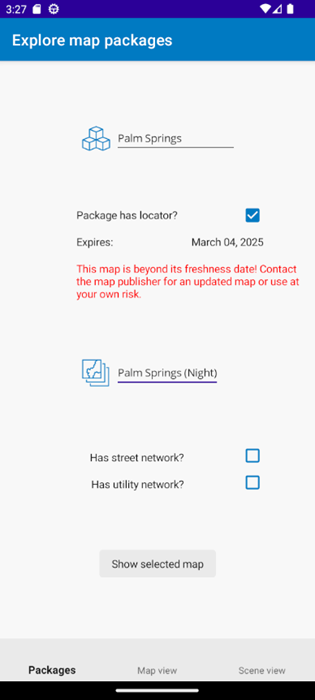
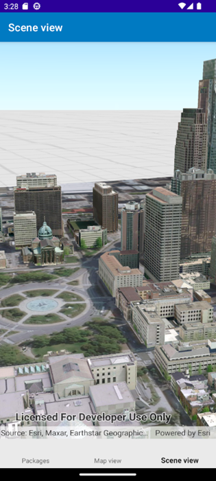
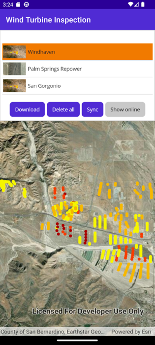
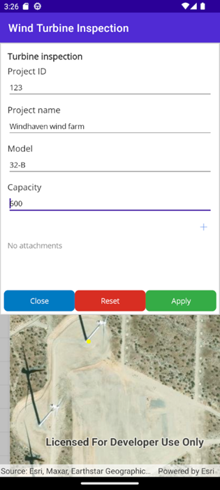

## Offline demo apps

This repo contains a couple of .NET MAUI apps that illustrate working with offline maps using ArcGIS Maps SDK for .NET.

- **Offline with packages:** Includes some map packages (.mmpk) as assets that are deployed with the app. You can select one of the packages to explore its capabilities and to view included maps. In the interest of file size, only a few small packages are included in the repo. You can add your own map (or scene) packages as assets if you want.

- **Offline ahead of time:** Reads an offline-enabled web map and displays a list of available map areas for use offline. If zoomed to an extent greater than 1:30000, the user can also take the current map extent offline. A tile package is deployed with the app to make this (on-demand) workflow more efficient by not downloading the basemap tiles with the map. Works with the [Wind turbine inspections](https://arcgisruntime.maps.arcgis.com/home/item.html?id=a0b18b344a314be88b34da34d51d5ee1) web map.

